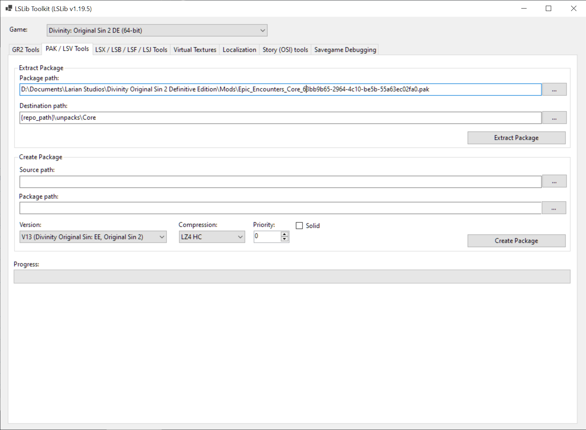
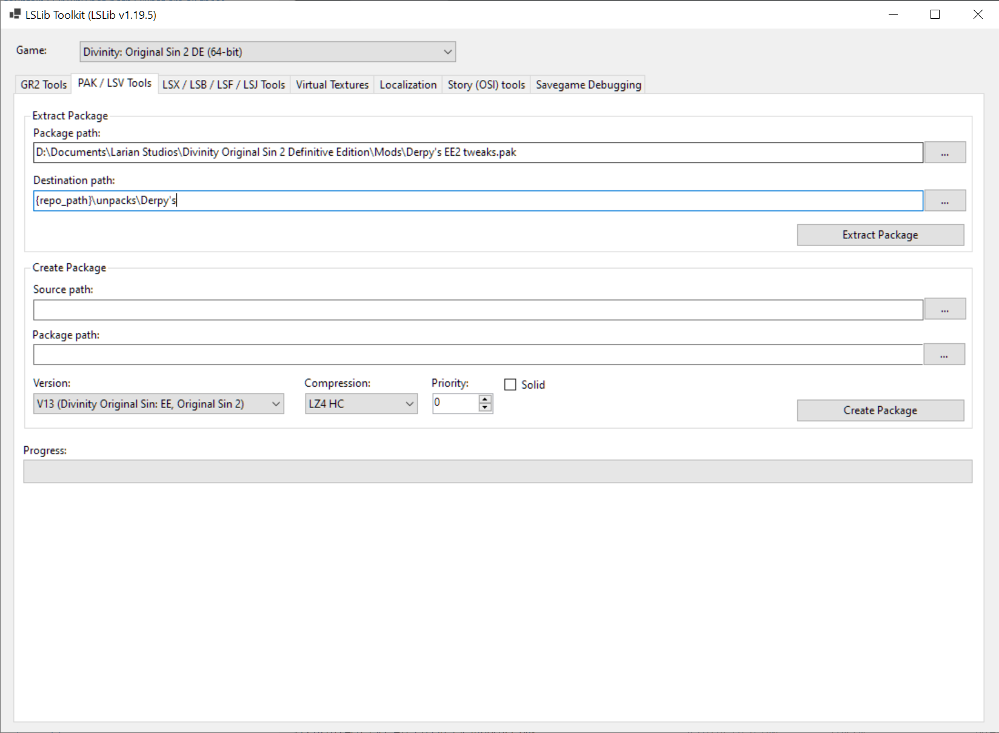
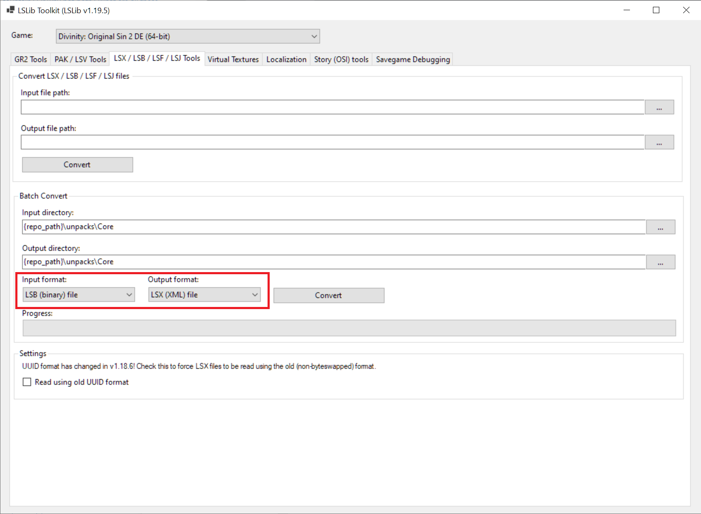

# DoS 2 Epic Encounters Ascension and Artifact Searcher

An ascension and artifact searcher for Divinity Original Sin 2 mod Epic Encounters. A derivation, but not direct fork, of https://xanthics.github.io/dos2_ascension/, rewritten completely and with some extra bonuses.

Contains semi-automation scripts to make it easier to update the website in the future.

Up to date with:
- Epic Encounters Origins v1.0.6.6
- Derpy's EE2 Tweaks v1.0.0.267

# Development Setup
Tested with 
- `node 23.11.0`
- `Python 3.12.9`

but as far as I'm aware, no specific feature to those specific versions should be required for this project.

## Preparing misc files and project hierarchy
1. Grab [Norbyte's export tool](https://github.com/Norbyte/lslib/releases)
2. Extend the project hierarchy to the following:
    - {repo}/
        - client/
        - data/
        - unpack/
            - Core/
            - Derpy's/
3. Locate your mods folder. It should be something like `Documents/Larian Studios/Divinity Original Sin 2 Definitive Edition/Mods`
    - Locate   
    `Epic_Encounters_Core_63bb9b65-2964-4c10-be5b-55a63ec02fa0.pak` and  
    `Derpy's EE2 tweaks.pak`  
    within this folder.
## Unpacking mod files
1. Start the export tool and go to `PAK / LSV Tools`. Unpack `Epic Encounters Core` into `unpacks/Core/`:

2. Then unpack `Derpy's EE2 Tweaks` into `unpacks/Derpy's/`:

3. Go to the `LSX/LSB/LSF/LSJ Tools` tab and note the `Batch Convert` area near the bottom.  
Set `Input Directory` to `{repo_path}/unpacks/core` and `Output Directory` to that exact same path.  
Change `Input Format` to `LSB (binary) file` and `Output Format` to `LSX (XML) file`.  
Click the `Convert` button and wait for it to finish.  

**
REPEAT THIS FOR THE `LSF (binary) file` OPTION IN THE `Input Format` DROPDOWN
**

4. Repeat Step 3. for Derpy's mod. Remember to change the directory paths to the requisite paths.

# Deploying
## Generating the database file
Assuming the above steps have been performed:

1. I highly suggest you setup a venv for this repo (as should be usual practice) but I won't guide you to do that. 
2. `pip install -r requirements.txt`
3. `cd data`
4. You might want to look at `create_db.py` very quickly just so you have an idea what it does. Note the one cli argument it accepts.  
Once you're ready, run: `python create_db.py --with-overwrite`
5. To verify this completed properly, look for an `ascensions.db` file in `client/prisma`

## Running the website
1. `cd client`
2. `npm install`
3. `npm run dev`
